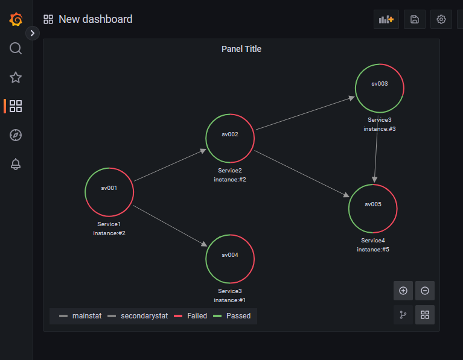

# grafana-node-graph

A light REST API to provide data to Grafana nodegraph panels powered by [nodegraph-api-plugin](https://github.com/hoptical/nodegraph-api-plugin).
Just a proof of concept at this time.



## Requirement
* Node >= 16

## As a developer

```
git clone grafana-node-graph.git
npm install
npm run start
```

## Run demo

### Run services
```
docker-compose up --build
```

### Install nodegraph-api-plugin
As you want :
* Go to `localhost:3000` > Settings > DataSources > Plugins > Node Graph API > Install
* OR `docker run -it /bin/bash <grafana_image>` then `grafana-cli plugins install hamedkarbasi93-nodegraphapi-datasource`
* OR copy [.zip file](https://github.com/hoptical/nodegraph-api-plugin/releases/latest) into `/var/lib/grafana/plugins` via `docker cp`

### Adds datasource and node graph panel
* Go to Settings > DataSources > New > Node Graph API
* URL field: `http://grafana_datasource_api:5000`

### Now: New Dashboard > New Panel > Node Graph